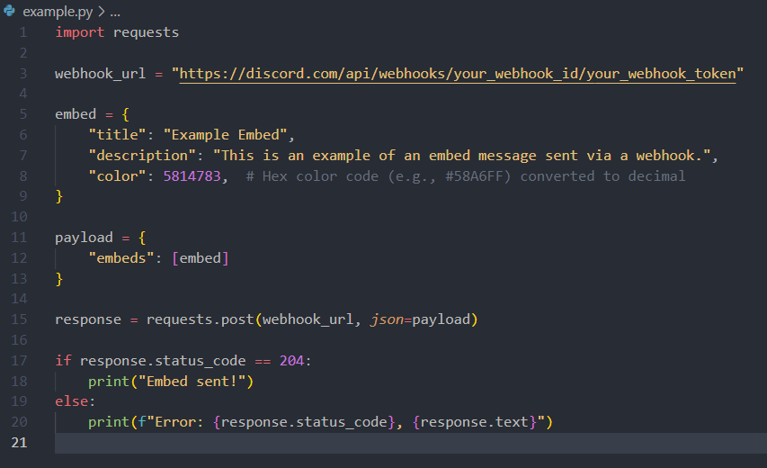
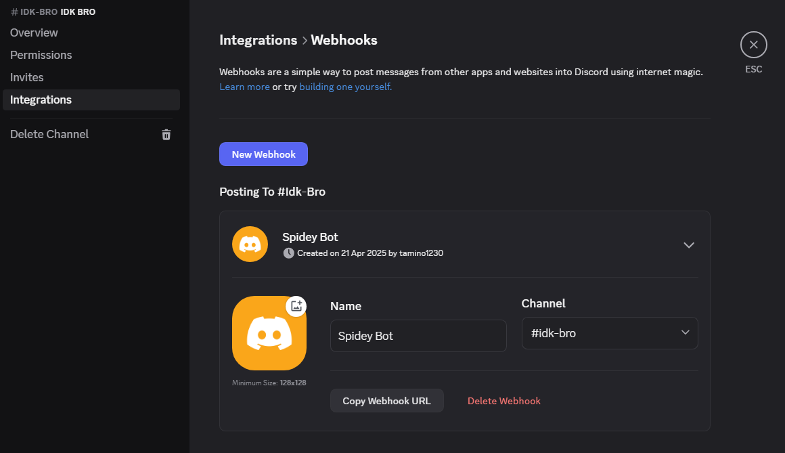
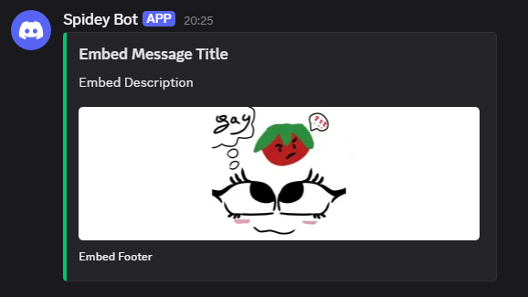

# Discord Webhook Manager

Welcome to the **Discord Webhook Manager**! This project provides an intuitive and user-friendly interface to manage Discord webhooks. You can send both normal and embed messages with ease, customize embed properties, and preview your messages before sending them.

---

## Features

- **Normal Messages**: Send plain text messages to your Discord channels.
- **Embed Messages**: Create rich embed messages with:
  - Custom titles
  - Descriptions
  - Colors
  - Footers
  - Images
- **Privacy First**: All data is processed locally in your browser.

---

## How to Use

### 1. Enter Your Webhook URL
Paste your Discord webhook URL into the input field labeled **Discord Webhook**.

### 2. Choose Message Type
Select the type of message you want to send:
- **Normal Message**: Enter plain text in the message content box.
- **Embed Message**: Fill in the embed-specific fields like title, description, color, etc.

### 3. Customize Your Message
For embed messages, you can:
- Add a title and description.
- Set a footer (default footer is provided if left blank).
- Choose a color using the color picker.
- Add an image URL.

### 4. Send the Message
Click the **Send** button to post your message to the Discord channel. A success or error alert will notify you of the result.

---

## How to Make a Discord Webhook

Follow these steps to create a Discord webhook:

1. **Open Discord**:
   - Navigate to the server where you want to create the webhook.

2. **Go to Server Settings**:
   - Click on the server name at the top-left corner.
   - Select **Server Settings** from the dropdown menu.

3. **Access Integrations**:
   - In the server settings menu, click on **Integrations**.

4. **Create a Webhook**:
   - Under the Webhooks section, click **Create Webhook**.
   - Give your webhook a name and optionally assign it an avatar.

5. **Select a Channel**:
   - Choose the channel where the webhook will post messages.

6. **Copy the Webhook URL**:
   - Click the **Copy Webhook URL** button. This URL will be used in the Discord Webhook Manager.

7. **Save Changes**:
   - Click **Save** to finalize the webhook setup.

> **Note**: Keep your webhook URL private to prevent unauthorized use.

---

## Is It Safe?

Yes, this tool is completely safe to use. All data is processed locally in your browser, ensuring your privacy. No webhook URLs or messages are stored or logged.

> **Disclaimer**: This tool is not affiliated with Discord. Use it at your own risk. The creator is not responsible for any misuse or abuse of the tool.

---

## Why Use Embed Messages?

Embed messages allow you to format your content in a visually appealing way. They support:
- Rich text
- Images
- Custom colors

This makes your messages stand out and look professional.

---

## Source Code

You can find the source code for this project on [GitHub](https://github.com/Tamino1230/tamino1230.github.io).

---

## Screenshots

### Normal Message Example

### Embed Message Example

---

## License

This project is licensed under the [MIT License](LICENSE).

---

## Contact

- **GitHub**: [Tamino1230](https://github.com/Tamino1230)
- **Discord Server**: [Join Here](https://discord.gg/8b8R9qCBF8)
- **Twitter**: [Share This Project](https://twitter.com/intent/tweet?text=Hey!%20Look%20at%20this%20Discord%20Webhook%20Manager%20Website%2C%20without%20knowing%20what%20to%20do%3A%20https%3A%2F%2Ftamino1230.github.io%0Aby%20https%3A%2F%2Fgithub.com%2Ftamino1230&url=)

---
